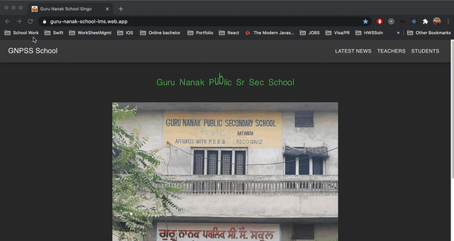

## Mini-School-LMS

This project is react + redux + firebase project. This web app is a CRUD application. The backend is firebase.

As the name suggests, it is a small LMS. I created this small LMS for high school in India. Due to COVID19, there are no in-person classes. This web app allows teachers to upload homework for students. Students can download or see the homework on their mobile phones.

Since the whole idea of LMS is very new for most of the schools in India. This web app doesn't allow students to upload their completed homework. It is a small test if teachers and students like this LMS, I will extend and add more functionality to this web app in future iterations

## Responsiveness 

In India, laptops are not very popular in school students. Most of the students don't have laptops, so this web app made for a mobile browser. This app looks very lovely in mobile orientation. Although this web app mode for mobile browsers, it also look very lovely on big screens

## State and Banckend

The state of the app is managed by redux. All the firebase operations are done with the help of redux actions. Firebase SDK is used for all CRUD operations. Firebase SDK is available as an NPM package. There are routes in this app. For routes, a react-router-dom package is used.

For database security, firebase rules are used.

## Deployment and live demo

The app is deployed with firebase hosting. Please check the following web address for a live demo.

https://guru-nanak-school-lms.web.app/

## Cached demo with firebase database

